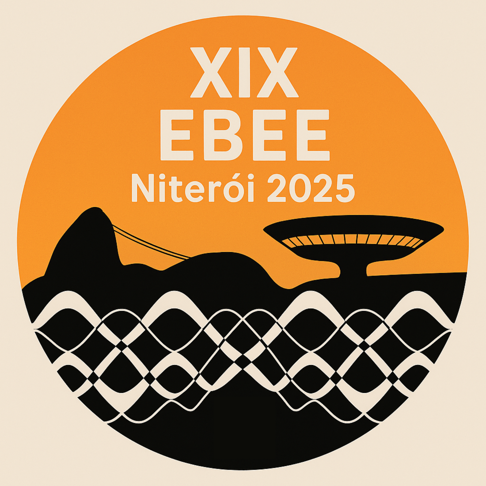
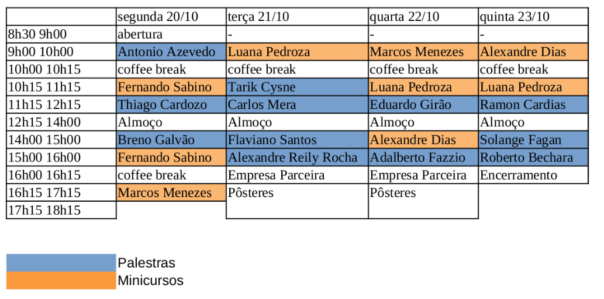
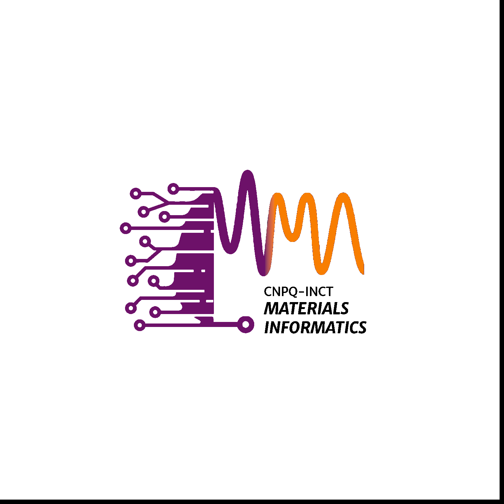
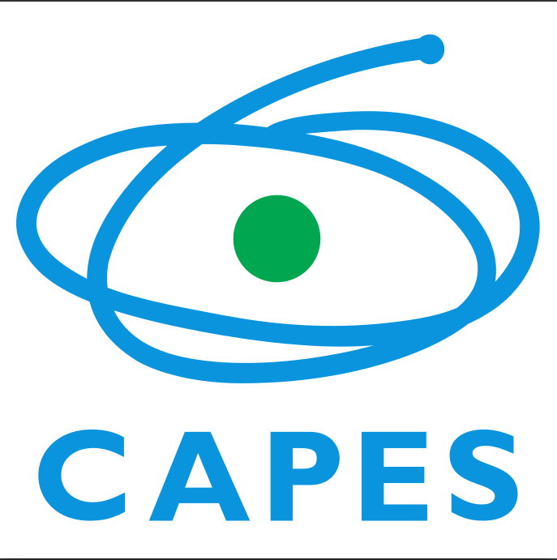

<!--  -->
<!--  -->

<!-- 

  

 -->

<!-- Marp (se usar Marp):  -->
<!-- Pandoc/Quarto: {width=180 .float-right} -->

<!-- 

  
  

 -->

<!-- 

  
  

 -->

<!--  -->
<!--  -->
<!-- 

 -->

<!--                      -->

  &nbsp;&nbsp;&nbsp;&nbsp;&nbsp;&nbsp;&nbsp;&nbsp;&nbsp; &nbsp;&nbsp;&nbsp;&nbsp;&nbsp;&nbsp;&nbsp;&nbsp;&nbsp; &nbsp;&nbsp;&nbsp;&nbsp;&nbsp;&nbsp;&nbsp;&nbsp;&nbsp; 

# XIX Escola Brasileira de Estrutura Eletrônica ([EBEE](https://www1.fisica.org.br/~ebee/xix/index.php))

A Escola Brasileira de Estrutura Eletrônica (EBEE) faz parte das Escolas de Física Jorge André Swieca, da Sociedade Brasileira de Física (SBF). 

A Escola Brasileira de Estrutura Eletrônica (EBEE) é um evento científico e educacional de caráter nacional que tem como objetivo principal a formação e o aprimoramento de estudantes de graduação e pós-graduação nas áreas de Física, Química, Ciência de Materiais e afins. Reunindo pesquisadores experientes e jovens estudantes, a EBEE oferece uma programação intensiva com minicursos, palestras, tutoriais e sessões de pôsteres, abordando desde fundamentos teóricos a aplicações computacionais avançadas em métodos como a Teoria do Funcional da Densidade (DFT), métodos pós-DFT, tight-binding, técnicas de dinâmica molecular e Inteligência Artificial.

Além de promover a capacitação técnica, a EBEE também desempenha um papel fundamental na integração da comunidade científica brasileira, incentivando colaborações interinstitucionais e o desenvolvimento de redes de pesquisa. Com edições realizadas em diferentes regiões do Brasil, a escola contribui para a descentralização do conhecimento e para a formação de recursos humanos altamente qualificados na área de simulação computacional de materiais.

### Coordenador
Marcio Costa     - Universidade Federal Fluminense

### Comitê Local

Rodrigo Amorim   - Universidade Federal Fluminense

Luciano T Costa  - Universidade Federal Fluminense

Reinaldo Faria   - Universidade Federal Fluminense

Felipe Lima      - Ilum/CNPEM

### Comitê de Programa

Andrea Latgé    - Universidade Federal Fluminense

Angela Klautau  - Universidade Federal do Pará

Gustavo Dalpian - Universidade de São Paulo

Pedro Venezuela - Universidade Federal Fluminense

Rodrigo Capaz   - Universidade Federal do Rio de Janeiro & LNNano/CNPEM

Sylvio Canuto   - Universidade de São Paulo

# Programa

  

## Minicursos

- **Alexandre C. Dias** (UnB) — *Excitonic Effects using WanTiBEXOS Package: A MLWF-TB+BSE approach*
- **Fernando Sabino** (USP – São Carlos) — *Introdução à Teoria do Funcional da Densidade: Fundamentos e Aplicações em Materiais*
- **Luana Pedroza** (IFUSP) — *Dinâmica Molecular na Era da Inteligência Artificial*
- **Marcos Menezes** (IF-UFRJ) — *Optical Properties of Nanomaterials from ab-initio Calculations*

## Palestras

- **Adalberto Fazzio** (Ilum/CNPEM) — *100 Anos de Mecânica Quântica e (quase) 100 Anos de Estrutura Eletrônica de Sólidos*
- **Alexandre Reily Rocha** (IFT-Unesp) — *Dinâmica de Água e Gelo utilizando Machine Learning e efeitos quânticos nucleares*
- **Antonio Azevedo** (UFPe) — *Unlocking Spin, Orbital and Charge Degrees of Freedom in Heterostructures*
- **Breno Galvão** (CEFET-MG) — *Molecules in the Interstellar Medium*
- **Carlos Mera** (UFABC) — *A New Chapter in Magnetism: The Rise of Altermagnets*
- **Eduardo Girão** (UFPI) — *Graph Theory Tools for the Search and Identification of New 2D Nanocarbons with Targeted Electronic Properties*
- **Flaviano dos Santos** (CBPF) — *Construindo e explorando modelos de spin a partir de métodos de primeiros princípios: do magnetismo não colinear às ondas de spin topológicas.*
- **Ramon Cardias** (CBPF) — *Estrutura eletrônica e magnetismo: do ab initio ao semi-clássico*
- **Roberto Bechara Muniz** (UFF) — *As contribuições científicas do Prof. José d'Albuquerque e Castro*
- **Solange Fagan** (UFN) — *Integrating Theory and Experiment: Ab Initio and Molecular Docking Approaches in Carbon Nanostructures*
- **Tarik Cysne** (IF-UFF) — *Orbitronics: From Transport to Topology*
- **Thiago Cardozo** (IQ-UFRJ) — *A Aristocracia Química — Previsão Teórica de Espécies Metaestáveis de Gases Nobres*

## Realização

<!--  -->

## Apoio

## Patrocínio

